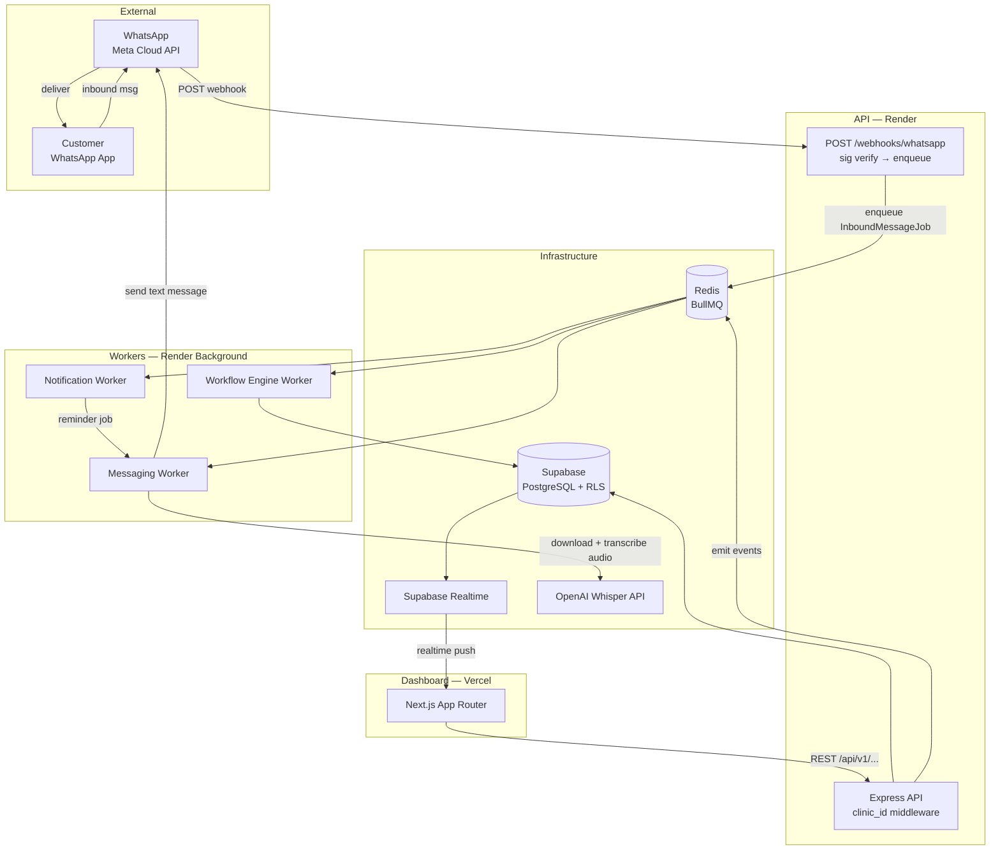
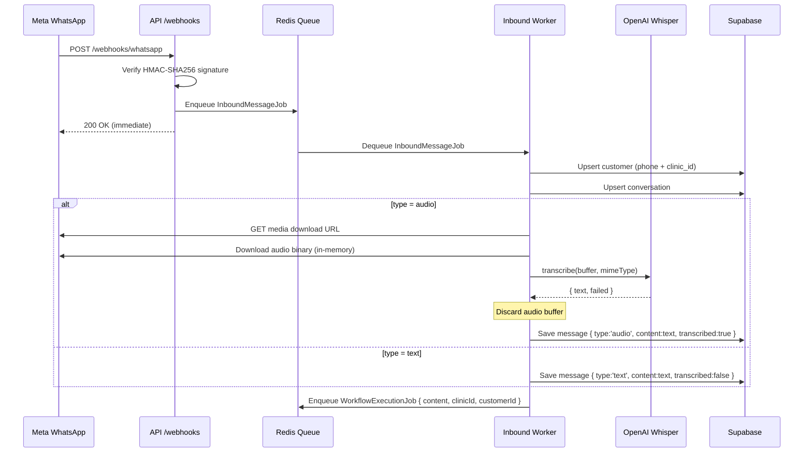
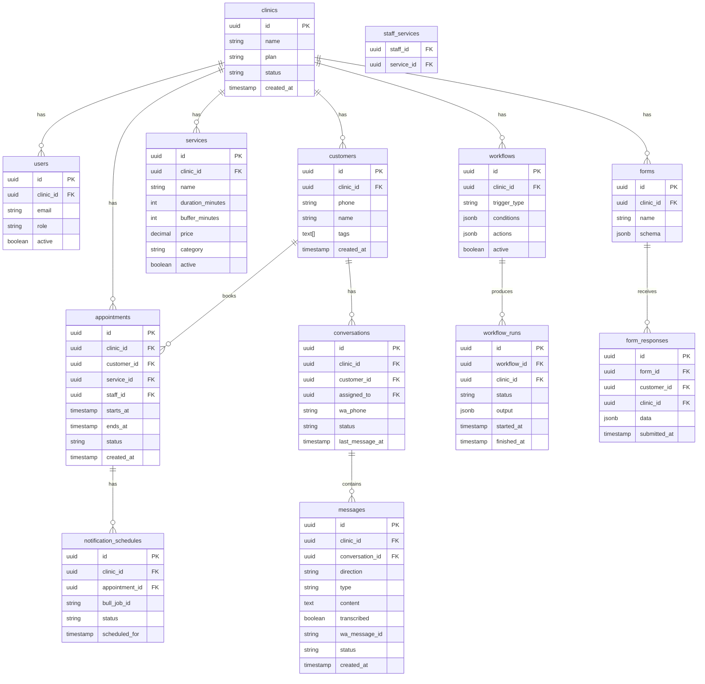

# Design: Clinic Booking Automation OS

## Overview
Three independently deployable services in an npm monorepo: `api` (Express, stateless), `workers` (BullMQ, separate process), `dashboard` (Next.js). All state lives in Supabase PostgreSQL and Redis. WhatsApp is an external event system — inbound via webhook, outbound via worker. Voice messages are transcribed in-memory via OpenAI Whisper; audio is never persisted.

---

## Architecture



---

## ADRs

### ADR-1: Monorepo with npm workspaces
**Status:** Accepted
**Context:** API, workers, and dashboard share types and WhatsApp client code.
**Decision:** npm workspaces monorepo with `apps/api`, `apps/workers`, `apps/dashboard`, `packages/db`, `packages/shared`, `packages/whatsapp`, `packages/transcription`.
**Consequences:** Shared types eliminate drift; single git repo; each app deploys independently.

### ADR-2: BullMQ workers as a completely separate process
**Status:** Accepted
**Context:** Workers must not be imported into the API — they share a Redis connection only.
**Decision:** `apps/workers` is a standalone Node.js process with its own `package.json` and Render service.
**Consequences:** API failures don't affect queue processing; horizontal scaling is independent.

### ADR-3: Supabase Auth as single auth source of truth
**Status:** Accepted
**Context:** Mixing Supabase Auth with custom JWT would create inconsistent session handling.
**Decision:** All authentication flows through Supabase Auth. The API validates the Supabase JWT on every request and extracts `clinic_id` from the user's `app_metadata`.
**Consequences:** No custom token issuance; Supabase manages refresh tokens, sessions, and email invites.

### ADR-4: clinic_id enforcement at service layer
**Status:** Accepted
**Context:** RLS alone is not sufficient defence — application bugs can bypass it.
**Decision:** Every service function that queries the DB accepts `clinicId` as an explicit parameter. No service function reads from context — it always receives the ID explicitly from the route middleware.
**Consequences:** Testable, auditable; RLS is second line of defence only.

### ADR-5: Voice messages transcribed in-memory, audio not persisted
**Status:** Accepted
**Context:** Customers send voice messages as natural input. The workflow engine and inbox operate on text. Audio storage adds cost and complexity with no benefit.
**Decision:** When an inbound audio message arrives, the worker SHALL: (1) fetch the Meta media download URL, (2) download the audio binary into memory, (3) transcribe via OpenAI Whisper API, (4) store only the transcribed text in `content` — no `media_url`, no file storage. The audio binary is discarded immediately after transcription. All downstream processing (intent detection, workflow triggers, inbox display) uses the transcription as canonical message text. On transcription failure: `content = "[Voice message — transcription failed]"`.
**Consequences:** No storage cost for audio. Staff see transcribed text in inbox with a mic icon indicating voice origin. No audio playback in MVP.

---

## Components and Interfaces

### `packages/shared` — shared types
```typescript
interface Clinic { id: string; name: string; plan: PlanTier; status: 'active'|'suspended' }
interface User   { id: string; clinicId: string; role: 'admin'|'provider'|'receptionist'; active: boolean }
interface Customer { id: string; clinicId: string; phone: string; name?: string; tags: string[] }
interface Appointment {
  id: string; clinicId: string; customerId: string
  serviceId: string; staffId: string
  startsAt: Date; endsAt: Date; status: AppointmentStatus
}
interface Message {
  id: string; clinicId: string; conversationId: string
  direction: 'inbound'|'outbound'
  type: 'text'|'audio'       // 'audio' = was voice, content is transcription
  content: string            // always populated — raw text or transcription
  transcribed: boolean       // true if content came from Whisper
  waMessageId: string; status: MessageStatus; createdAt: Date
  // media_url intentionally absent — audio is never persisted
}
interface Workflow {
  id: string; clinicId: string; trigger: TriggerType
  conditions: Condition[]; actions: Action[]; active: boolean
}
```

### `packages/whatsapp` — Meta Cloud API client
```typescript
interface WhatsAppClient {
  sendText(to: string, text: string): Promise<{ messageId: string }>
  sendTemplate(to: string, template: string, params: string[]): Promise<{ messageId: string }>
  getMediaDownloadUrl(mediaId: string): Promise<string>
  downloadMedia(url: string): Promise<Buffer>
  verifyWebhookSignature(payload: Buffer, signature: string): boolean
}
```

### `packages/transcription` — OpenAI Whisper client
```typescript
interface TranscriptionClient {
  // Never throws. On failure returns fallback text and logs error.
  transcribe(audioBuffer: Buffer, mimeType: string): Promise<{
    text: string
    durationSeconds: number
    failed: boolean
  }>
}
// Implementation: OpenAI Whisper API (model: whisper-1)
// Fallback on failure: { text: '[Voice message — transcription failed]', failed: true }
```

### `apps/api` — REST API (Express)
```
POST /api/v1/webhooks/whatsapp        — no auth, sig verify only, enqueue + 200
POST /api/v1/auth/invite              — admin only
GET  /api/v1/slots                    — available slots (service + date + staff)
GET  /api/v1/appointments             — paginated, clinic-scoped
POST /api/v1/appointments             — create, emits AppointmentCreatedEvent
PATCH /api/v1/appointments/:id        — reschedule / cancel
GET  /api/v1/customers                — search + filter
GET  /api/v1/customers/:id/timeline   — messages, appointments, notes, form responses
GET  /api/v1/conversations            — inbox list
POST /api/v1/conversations/:id/messages — staff reply, enqueues OutboundMessageJob
GET  /api/v1/services                 — clinic services
POST /api/v1/services                 — create/edit service
GET  /api/v1/workflows                — clinic workflows
POST /api/v1/workflows                — create workflow
GET  /api/v1/workflows/:id/runs       — execution log
```

### `apps/workers` — BullMQ queues and processors
| Queue | Job | Processor |
|---|---|---|
| `messaging` | `InboundMessageJob` | verify → upsert customer/conversation → if audio: download+transcribe+discard → save message → enqueue WorkflowExecutionJob |
| `messaging` | `OutboundMessageJob` | call WhatsApp sendText/sendTemplate → update message status |
| `workflow` | `WorkflowExecutionJob` | evaluate trigger→condition→action chain → enqueue child jobs |
| `notifications` | `ReminderJob` | delayed BullMQ job → enqueues OutboundMessageJob when fires |

---

## Inbound Message Pipeline



---

## Data Models



---

## Scheduling Engine

Slot generation:
1. Load staff working hours for target date.
2. Load all existing appointments for that staff on that date (including buffer time).
3. Generate candidates: `workStart + n × (duration + buffer)` until `workEnd`.
4. Filter slots overlapping any existing appointment.
5. Filter slots on holidays or blocks.
6. Return remaining slots.

Booking uses a PostgreSQL advisory lock per `(staff_id, starts_at)` to prevent double-booking under concurrent requests.

---

## Error Handling
- API errors: `{ error: { code, message, requestId } }` — never expose stack traces.
- Worker failures: BullMQ exponential backoff, max 3 retries, then dead-letter queue.
- Webhook: always return 200 to Meta immediately. Processing failures are handled async via queue retry.
- Transcription failure: store `content = '[Voice message — transcription failed]'`, `transcribed: false`, log error — never drop the message.
- DB double-booking: PostgreSQL advisory lock + unique constraint → 409 Conflict at API layer.

---

## Security Architecture

| Threat | Mitigation |
|---|---|
| Cross-tenant data access | `clinic_id` explicit param on every service call + Supabase RLS |
| WhatsApp webhook spoofing | HMAC-SHA256 signature verified before any processing |
| Broken object-level auth | Middleware extracts `clinic_id` from Supabase JWT; client-supplied `clinic_id` is never trusted |
| Mass assignment | Zod validation on all request bodies |
| Secrets exposure | All credentials via env vars; nothing logged |
| Audit trail | `audit_logs` table: actor, action, resource_id, clinic_id, timestamp |

---

## Scalability & Performance
- API stateless → horizontal scaling on Render.
- Workers stateless → scale independently (separate Render background service).
- All session and queue state in Redis; all persistent state in Supabase.
- Supabase Realtime for inbox live updates — no polling, no self-managed WebSocket server.
- Target: API p95 < 200ms reads; booking endpoint < 500ms (includes advisory lock).
- BullMQ concurrency: 5 messaging jobs, 3 workflow jobs per worker instance.
- Whisper transcription adds ~1–3s latency to inbound voice processing (async, non-blocking to webhook).

---

## Environment Variables
```
SUPABASE_URL
SUPABASE_ANON_KEY
SUPABASE_SERVICE_ROLE_KEY
DATABASE_URL
SUPABASE_JWT_SECRET
WHATSAPP_API_TOKEN
WHATSAPP_PHONE_NUMBER_ID
WHATSAPP_WEBHOOK_VERIFY_TOKEN
REDIS_URL
OPENAI_API_KEY
NODE_ENV
PORT
APP_URL
```
