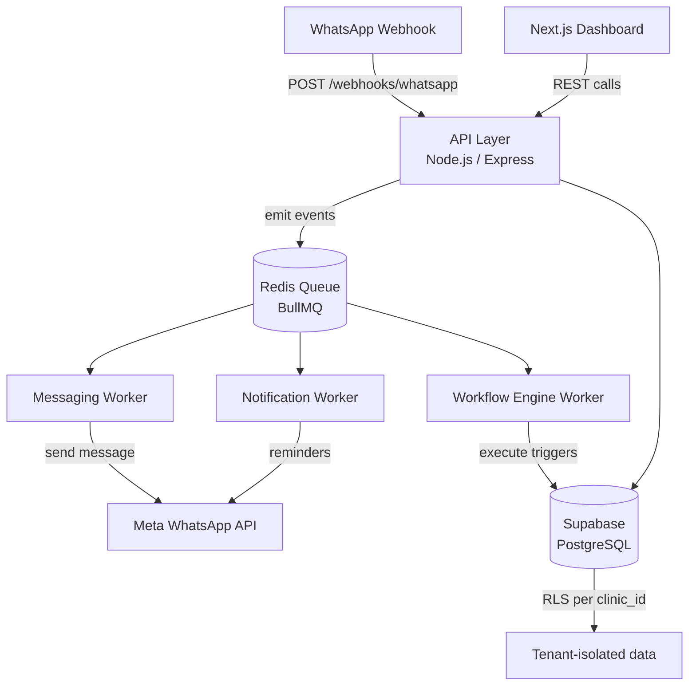

# Clinic Booking Automation — Project Plan

## Goal
A multi-tenant SaaS clinic operating system. WhatsApp is the primary customer interface. Clinics configure services, staff, workflows, and forms through a web dashboard. The system handles scheduling, CRM, messaging, reminders, and automation across unlimited clinic tenants.

## Tech Stack

| Layer | Choice | Rationale |
|---|---|---|
| Backend | Node.js + TypeScript | Ecosystem maturity for webhooks, retries, BullMQ |
| Frontend | Next.js (App Router) | SSR + API routes, deploys to Vercel |
| Database | Supabase (PostgreSQL) | Managed Postgres, RLS, Realtime, Auth |
| Auth | Supabase Auth | Single source of truth — no mixed JWT |
| Queue | Redis + BullMQ | Proven for job queues, retries, delays |
| WhatsApp | Meta Cloud API (webhooks) | External event system, not sync |
| Frontend hosting | Vercel | Zero-config Next.js |
| Backend hosting | Render | Stateless services, separate worker dyno |

## Architecture



**Key constraint:** Every API route that touches DB data passes `clinic_id` extracted from the authenticated session. No route has cross-tenant access. Workers receive `clinic_id` in every job payload.

## Layers

### 1. API Layer (`/api`)
- Express + TypeScript, stateless
- Auth middleware: validates Supabase JWT, extracts `clinic_id`
- Routes: appointments, customers, messages, services, forms, workflows, staff, webhooks
- Never sends WhatsApp messages directly — enqueues jobs only

### 2. Worker Layer (`/workers`) — separate process
- BullMQ consumers for: `messaging`, `workflow`, `notifications`
- Runs independently on Render as a background worker service
- All jobs include `clinic_id` in payload

### 3. Workflow Engine (`/workers/workflow-engine`)
- Evaluates trigger → condition → action chains per clinic config
- Triggers: appointment.created, appointment.completed, no_response, time_based
- Actions: send_whatsapp, assign_staff, add_tag, trigger_workflow

### 4. WhatsApp Layer (`/webhooks`, `/services/whatsapp`)
- Incoming: POST /webhooks/whatsapp → parse → enqueue for workflow engine
- Outgoing: messaging worker → Meta Cloud API
- Session state tracked in DB per conversation

### 5. Frontend (`/dashboard`) — Next.js
- Modules: Inbox, Calendar, Appointments, CRM, Forms, Workflows, Analytics, Settings
- All calls authenticated with Supabase session

## File Structure

```
clinic-booking-automation/
├── apps/
│   ├── api/                  # Express API server
│   │   ├── src/
│   │   │   ├── routes/
│   │   │   ├── middleware/
│   │   │   ├── services/
│   │   │   └── index.ts
│   │   └── package.json
│   ├── workers/              # BullMQ workers — separate process
│   │   ├── src/
│   │   │   ├── queues/
│   │   │   ├── processors/
│   │   │   └── workflow-engine/
│   │   └── package.json
│   └── dashboard/            # Next.js frontend
│       ├── app/
│       ├── components/
│       └── package.json
├── packages/
│   ├── db/                   # Supabase client + migrations
│   ├── shared/               # Types, constants, utils shared across apps
│   └── whatsapp/             # Meta Cloud API client
├── .claude/
├── .spec/
├── .env.example
├── .gitignore
└── package.json              # Monorepo root (npm workspaces)
```

## Monorepo
npm workspaces. Three deployable services: `api`, `workers`, `dashboard`. Shared packages in `/packages`.

## Data Model (Core Tables)
All tables include `clinic_id UUID NOT NULL` + FK to `clinics`.

| Table | Purpose |
|---|---|
| `clinics` | Tenants — each clinic is a row |
| `users` | Staff per clinic |
| `customers` | Patients/clients per clinic |
| `appointments` | Bookings linked to customer + service + staff |
| `services` | Clinic-defined services (duration, price, staff) |
| `messages` | WhatsApp message log per conversation |
| `conversations` | WhatsApp session per customer |
| `workflows` | Trigger/condition/action config per clinic |
| `workflow_runs` | Execution log per workflow |
| `forms` | Dynamic form schemas per clinic |
| `form_responses` | Submitted responses |
| `notification_schedules` | Pending reminders/follow-ups |

## Multi-Tenant Rules
1. Every DB table: `clinic_id UUID NOT NULL REFERENCES clinics(id)`
2. Every query: `WHERE clinic_id = $clinic_id` — no exceptions
3. Supabase RLS policies as a second line of defence
4. API middleware extracts `clinic_id` from JWT and injects into all service calls
5. Workers receive `clinic_id` in every BullMQ job payload — never infer it

## Security Baseline
- Supabase RLS enabled on all tables
- Input validation on every route (Zod)
- WhatsApp webhook signature verification on every inbound request
- No secrets in code — all via env vars
- Audit log table for staff actions

## MVP Scope (Phase 1)
1. Tenant onboarding + auth
2. Service + staff configuration
3. Scheduling engine (slot gen, booking, reschedule, cancel)
4. WhatsApp webhook ingestion + session tracking
5. Manual messaging from dashboard inbox
6. Basic workflow: appointment reminder 24h before
7. Customer CRM (profile, timeline, tags)
8. Web dashboard: Inbox, Calendar, Appointments, CRM
